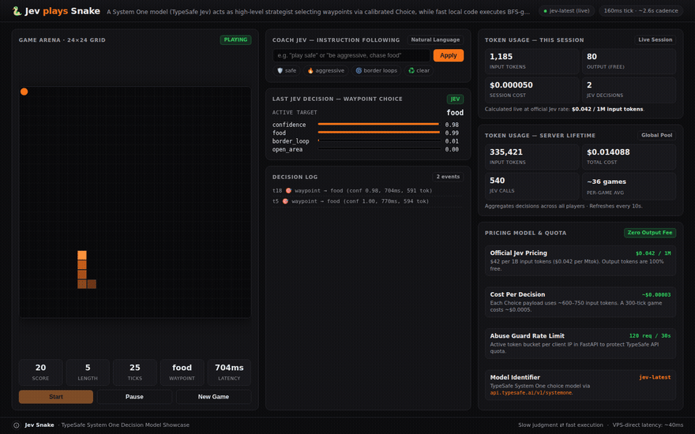

# 🐍 Jev Snake

[](LICENSE)
[](https://www.python.org/downloads/)
[](https://fastapi.tiangolo.com)
[](https://jevsnake.stevanuspangau.dev)

An interactive real-time game showcasing how a **System One decision model** ([TypeSafe Jev](https://typesafe.ai)) can act as a high-level game strategist without succumbing to inference latency.

**🎮 Live demo: [https://jevsnake.stevanuspangau.dev](https://jevsnake.stevanuspangau.dev)**



---

## 🏛️ Architecture: Strategist ⇄ Executor Pattern

Standard LLM integration in real-time loops typically fails because network and model latency (~100ms–800ms) easily lag behind high-frequency game ticks (160ms), causing immediate crashes.

**Jev Snake** solves this with a decoupled **Strategist ⇄ Executor** pattern:

```text
Browser Canvas (Game Loop, Geometry, Seatbelt)
   ├── EXECUTOR (Every tick, 160ms):
   │     • Greedy pathing step toward the active waypoint
   │     • Breadth-First Search (BFS) flood-fill seatbelt
   │     • Automatically vetoes candidate moves into trapped pockets (<8 free cells)
   │
   └── STRATEGIST (Every ~2.6s cadence + on food eaten):
         • POST /api/decide → TypeSafe Jev Choice API
         • Evaluates candidate waypoints: 'food', 'open_area', 'border_loop'
         • Interprets player coaching directives in plain English
         • Calibrated probability distributions displayed live in the HUD
```

### Key Engineering Benefits
- **Lag Immunity**: A strategic waypoint remains valid across multiple ticks. Latency variations can never freeze the snake or cause a collision.
- **Natural Language Steering**: The player coaches Jev in plain text (e.g. *"play safe, avoid your tail"* vs *"be aggressive, chase the food"*). Behavior changes dynamically with zero code changes.
- **Deterministic Safeguards**: The local BFS engine guarantees the snake never makes an unforced suicidal turn, letting the AI focus purely on strategic macro decisions.
- **Graceful Fallback**: If the API key is missing or the endpoint is unreachable, the executor seamlessly falls back to local greedy food pathing. The HUD badge transparently indicates `JEV` vs `fallback`.

### Verifying That Jev Is Really Driving

The `/api/decide` response makes it easy to prove decisions come from the model rather than from the deterministic fallback:

```text
Neutral prompt            → source "jev", action "food",       confidence 1.00,
                            probabilities {food: 1.00, open_area: 0.00, border_loop: 0.00},
                            ~570 input tokens, ~950 ms

Coached: "Avoid the food" → source "jev", action "open_area",  confidence 0.71,
                            probabilities {open_area: 0.81, border_loop: 0.18, food: 0.01},
                            ~610 input tokens, ~820 ms
```

The fallback path can never produce these outputs: it always picks `food` first, always returns
an empty probability distribution with confidence `0.0`, and always reports `0 ms / 0 tokens`.
Whenever you see calibrated probabilities and nonzero token usage, the decision is genuinely
made by Jev — and the natural-language steering test above confirms the model actually
understands the instruction instead of following a fixed rule.

---

## ⚡ Token Economics

Jev's official pricing is **$42 per 1B input tokens ($0.042 per 1M input tokens)** with **free output tokens**:

- **Per Decision**: Each Choice payload uses ~600–750 input tokens ≈ **$0.00003**.
- **Full Game (300 ticks)**: ~20 strategy calls ≈ **$0.0005** (under half a tenth of a cent).
- **Persistence**: Server lifetime token consumption is tracked atomically in a local SQLite database (`usage.db`) with WAL mode.

---

## 🚀 Quick Start

### Prerequisites
- Python 3.10+
- [uv](https://github.com/astral-sh/uv) (recommended) or standard `venv` + `pip`

### 1. Clone & Install

```bash
git clone https://github.com/StevanusPangau/jev-snake.git
cd jev-snake

# Create virtual environment and install dependencies
uv venv .venv
source .venv/bin/activate
uv pip install -r requirements.txt
```

### 2. Configure Environment

Copy the example configuration:

```bash
cp .env.example .env
```

Edit `.env` and set your TypeSafe API key:

```env
TYPESAFE_API_KEY=your_typesafe_api_key_here
PORT=8915
```

*(Note: The game runs in deterministic fallback mode if no API key is provided.)*

### 3. Run Server

```bash
python -m uvicorn server:app --host 127.0.0.1 --port 8915 --reload
```

Open `http://localhost:8915` in your browser.

---

## 🧪 Headless Simulation

You can verify the strategist-executor loop headlessly (running 3 full games across 150 ticks):

```bash
python simulate.py
```

---

## 📡 API Reference

| Endpoint | Method | Description |
|---|---|---|
| `/` | `GET` | Serves the full-screen canvas web dashboard |
| `/api/decide` | `POST` | Bridge to Jev Choice API. Accepts legal moves, state snapshot, and optional coaching instructions |
| `/api/usage` | `GET` | Returns persistent server-lifetime token counters and cost |
| `/api/status` | `GET` | Health check and TypeSafe key configuration status |
| `/health` | `GET` | Basic liveness probe (`{"ok": true}`) |

---

## 🛡️ Security & Production Hardening

- **No Secrets in Repo**: API keys and environment files are ignored via `.gitignore`.
- **Abuse Guard Rate Limiting**: Built-in in-memory token bucket (`120 requests / 30s` per IP) with automatic stale client cleanup.
- **Daily Token Budget**: Server-side daily input-token cap (default `2M tokens/day` ≈ `$0.084`, configurable via `JEV_DAILY_TOKEN_BUDGET`). When exhausted, the server transparently switches to deterministic fallback mode — the game keeps working and worst-case upstream cost stays bounded even against distributed abuse.
- **Proxy Aware**: Resolves client IPs correctly via `CF-Connecting-IP` and `X-Forwarded-For`.
- **Security Headers**: Injected automatically (`Content-Security-Policy`, `X-Content-Type-Options`, `X-Frame-Options`, `Referrer-Policy`, `Permissions-Policy`).
- **Input Validation**: Pydantic schemas enforce bounds on candidate moves and instruction strings to prevent payload amplification.

---

## 📁 Project Structure

```text
jev-snake/
├── server.py          # FastAPI app: /api/decide bridge, rate limiting, security headers
├── db.py              # SQLite (WAL) lifetime token telemetry with atomic counters
├── simulate.py        # Headless simulation of the strategist-executor loop
├── static/index.html  # Canvas SPA: game loop, BFS seatbelt, HUD & telemetry dashboard
├── .env.example       # Environment variable template
└── requirements.txt   # Python dependencies (FastAPI, uvicorn)
```

---

## 📄 License

This project is licensed under the [MIT License](LICENSE).
